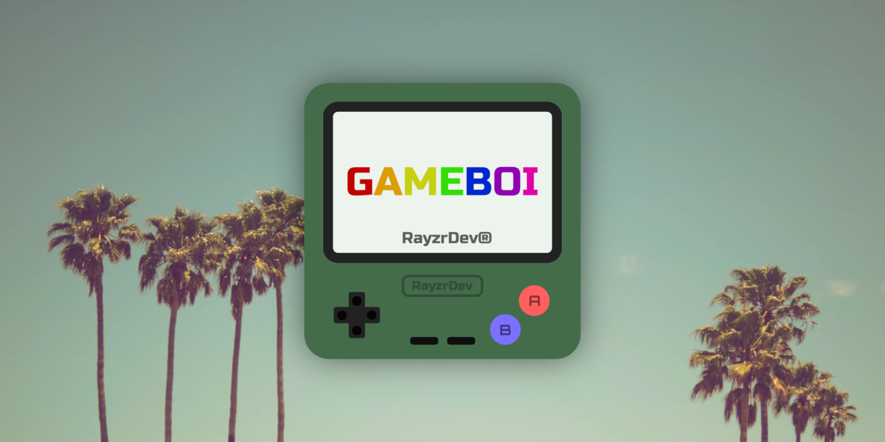
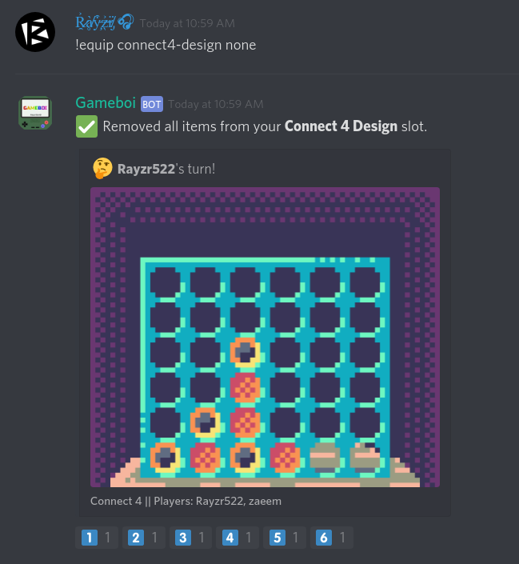
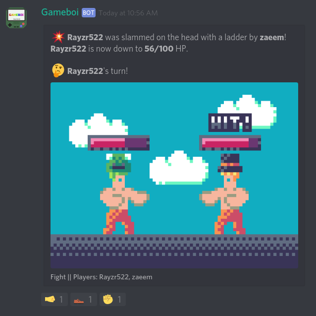
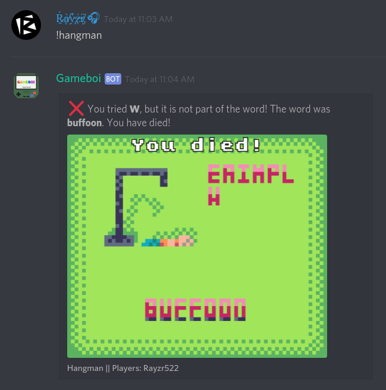
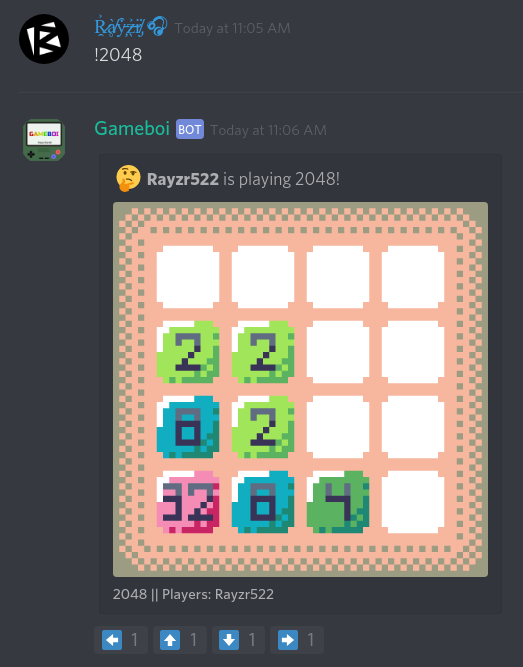

<h1 align="center">Gameboi</h1>
<p align="center"><i>Made with :heart: by <a href="https://github.com/Rayzr522">@Rayzr522</a> and <a href="https://github.com/zp4rker">@zp4rker</a></i></p>

[](https://patreon.com/Rayzr522)
[](https://rayzr.dev/join)

> A simple Discord bot made for Discord Hack Week 2019 with a plethora of small games you can play, as well as a global currency and shop system!

**Gameboi** aims to be not only a cool entry for the **Discord Hack Week** of 2019, but also aims to be a full feature game bot to bring a new level of fun and games to your server!

With 2 multiplayer games (Fight & Connect 4) and 2 singleplayer games (Hangman & 2048), Gameboi is sure to liven up any server, and the charm of its retro pixel-art graphics feels right at home to any old-school gamer.

Head down to [Screenshots](#screenshots) for some screenshots of Gameboi in action! :)

## Invite

Click [here](https://discordapp.com/oauth2/authorize?scope=bot&client_id=593090553856524298&permissions=8192) to invite the bot to your server!

You can also join the [official RayzrDev server](https://rayzr.dev/join) to play with Gameboi yourself :)

## Download

You can download and run the bot yourself by grabbing the latest JAR from [the RayzrDev Jenkins server here](https://ci.rayzr.dev/job/Gameboi). Simply run the JAR from the commandline like so:

```bash
java -jar gameboi-VERSION-jar-with-dependencies.jar
```

A `config.yml` file will be generated in the working directory the first time you run the bot, so just fill in your bot token and prefix and you're good to go!

## Commands

Command | Description
------- | -----------
`help` | Shows you help for Gameboi
`invite` | Gives you an invite link for Gameboi
`about` | Shows you information about Gameboi
`ping` | Shows you the bot's ping
`stats [game]` | Shows your game stats
`connect4 <other>` | Invites a player to play Connect4 with you!
`fight <other>` | Invites a player to play Fight with you!
`2048` | Starts a 2048 game.
`hangman` | Starts a hangman game.
`quit` | Quits you from your current match
`shop` | Lets you see what is available for purchase in the shop
`buy <item>` | Lets you buy items from the shop
`inventory` | Shows you what items you currently have
`equip <slot> <none OR item>` | Lets you equip different items

## Screenshots

### Connect 4

> Player 2 (yellow) is using the **Circle Design** item.



### Fight

> Player 1 is using the **Ribbit Hat** item, while Player 2 is using the **Tophat** item.



### Hangman



### 2048



## Join Me

[](https://discord.io/rayzrdevofficial)
