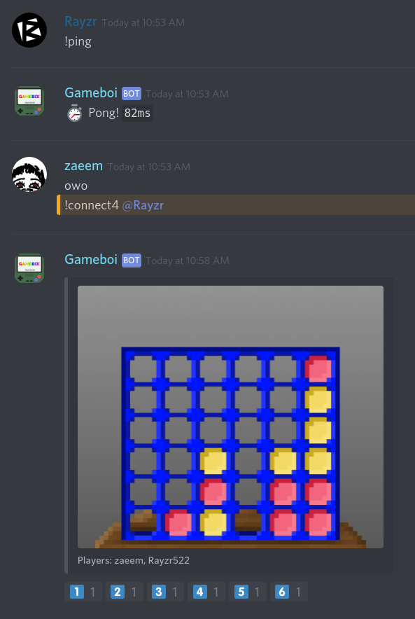

<h1 align="center">Gameboi</h1>
<p align="center"><i>Made with :heart: by <a href="https://github.com/Rayzr522">@Rayzr522</a> and <a href="https://github.com/zp4rker">@zp4rker</a></i></p>

[](https://patreon.com/Rayzr522)
[](https://rayzr.dev/join)

> A super fun Discord game bot made for Discord Hack Week 2019!

**Gameboi** aims to be not only a cool entry for the **Discord Hack Week** of 2019, but also aims to be a full feature game bot to bring a new level of fun and games to your server!

With 2 multiplayer and 2 singleplayer games currently in the works, Gameboi is sure to liven up any server, and the charm of its retro pixel-art graphics feels right at home to any old-school gamer.

Here is a work-in-progress screenshot of the *Connect 4* game being played by two players (myself, and @zp4rker who is my buddy for DHW!):



## Invite

There is currently no invite publically available for Gameboi, but one will be posted as soon as Discord Hack Week is over and the bot is on stable hosting!

## Download

You can download and run the bot yourself by grabbing the latest JAR from [the RayzrDev Jenkins server here](https://ci.rayzr.dev/job/Gameboi). Simply run the JAR from the commandline like so:

```bash
java -jar gameboi-VERSION-jar-with-dependencies.jar
```

A `config.yml` file will be generated in the working directory the first time you run the bot, so just fill in your bot token and prefix and you're good to go!

## Join Me

[](https://discord.io/rayzrdevofficial)
